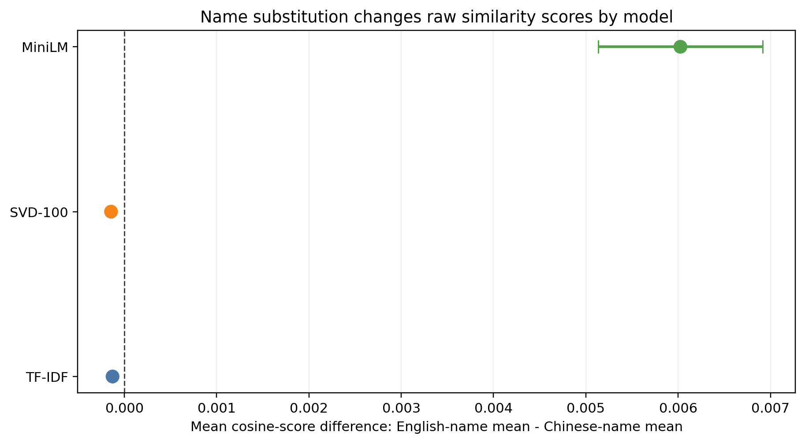

# Resume Screening Semantic-Match Sensitivity Audit

**Question:** How sensitive is cosine-similarity resume screening to variables that should not change evidence of job qualification?



**Answer:** TF-IDF and SVD-100 changed by only about 0.0001 raw cosine units;
MiniLM changed by 0.0060 (95% CI 0.0051 to 0.0069), with 36.1% of JDs
exceeding 0.01. These are score sensitivities, not evidence of employer
behaviour or hiring discrimination.

[](https://github.com/HansonChen06/resume-screening-audit/actions/workflows/ci.yml)

This repository contains a controlled audit connecting the
SVD word-embedding methods used in MATH 308 with real job descriptions captured
through ApplyPilot. It is a research artifact, not a screening product or a
reproduction of a commercial applicant-tracking system.

## Results at a glance

- 4,621 live postings fetched from 21 successful Greenhouse/Lever boards plus
  two ApplyPilot captures; 322 deterministically selected before text screening.
- 269 independent JDs retained and 53 rejected by pre-score quality rules.
- Category counts: SWE 70, data 60, consulting 43, product 60, unclassified 36.
- 23,403 scores from 29 controlled variants, 269 JDs, and three models.
- All three instruments passed the unrelated-nursing-resume positive control.
- Nine unit tests cover export logic, multilingual classification, pairing,
  effect size, and deterministic embeddings.

The seven-page report is available at [report/report.pdf](report/report.pdf).

## Completion criteria

The project is complete only when:

- the README opens with one question, one main figure, and one evidence-backed answer;
- `make all` rebuilds every processed dataset, result, figure, and the report from documented raw inputs;
- the PDF report contains Abstract, Methods, Results, Limitations, and Conclusion sections;
- every confirmatory conclusion includes an effect size, confidence interval, and the preregistered multiple-comparison correction;
- `HYPOTHESES.md` is committed before any audit analysis code or result inspection; and
- a clean environment reproduces the committed outputs with fixed dependency versions and seeds.

## Explicit non-goals

- No web interface
- No REST API
- No database or user system
- No Docker orchestration
- No "platform" framing
- No claim that cosine similarity reproduces a commercial ATS

> If I am writing UI, I have left the research question.

## Completed stages

1. Recovered and documented the surviving MATH 308 baseline and corrected
   unsupported claims in its companion repository.
2. Frozen and quality-gated a real JD corpus from ApplyPilot and public ATS APIs.
3. Preregistered hypotheses at `8f1e3be`, extended corpus sources at `8db02d9`,
   and froze corpus/model inputs at `ad837a4` before scoring.
4. Validated TF-IDF, SVD-100, and MiniLM with positive and determinism controls.
5. Ran programmatic counterfactual variants with seed 42.
6. Reported paired raw effects, d_z, 95% intervals, FDR-adjusted p-values,
   Wilcoxon/sign-flip checks, category strata, split samples, and trimming.
7. Generated committed results, figures, notebooks, tests, CI, and PDF report.

## Reproduce locally

Python 3.9 and the exact versions in `requirements.txt` are required. The
sentence-transformer revision is frozen in `docs/pre-score-freeze.md`.

```bash
python3 -m pip install -r requirements.txt
python3 scripts/cache_model.py
make test
make all
```

The public repository does not redistribute the copyrighted full text of 269
job postings. Exact raw-to-report reconstruction therefore requires the frozen
local `data/raw/` snapshot. The committed scores, results, figures, and report
permit independent inspection of every reported statistic without that text.

## Export the local JD corpus

```bash
python3 scripts/export_jds.py \
  --input /Users/sihanchen/Desktop/ApplyPilot-MVP/data/data.json
```

The command writes ignored, local-only files under `data/raw/`: the retained
corpus, a rejection ledger, and a quality report. It never modifies ApplyPilot.
Run the current data-stage tests with:

```bash
python3 -m unittest discover -s tests -v
```
